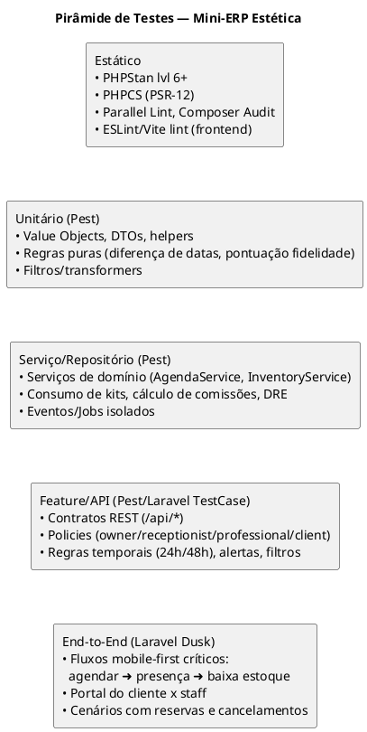
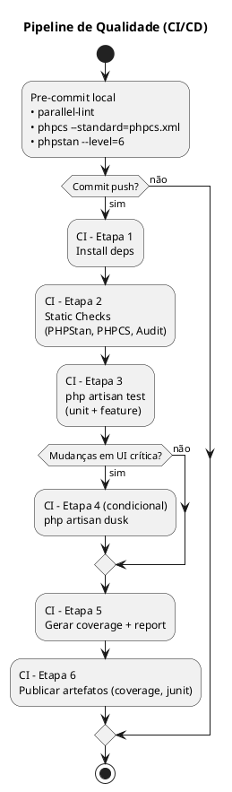
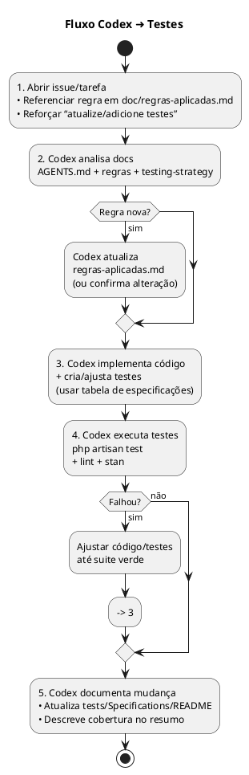

# Mini-ERP Estética — Estratégia de Testes

> Esta estratégia considera os requisitos consolidados em `AGENTS.md` e as regras dinâmicas mantidas em `doc/regras-aplicadas.md`. Ela guia como estruturar, automatizar e evoluir os testes garantindo segurança em cada entrega.

## 1. Princípios Gerais
- **Cobertura orientada a domínio:** cada regra de negócio documentada precisa de pelo menos um teste automatizado associado.
- **Padrão pirâmide de testes:** priorize testes rápidos e determinísticos (unitários e de serviço), apoiados por testes de API/feature e uma camada fina de fluxos end-to-end críticos.
- **Documentação viva:** qualquer nova regra em `doc/regras-aplicadas.md` deve apontar para o teste correspondente (ver §6).
- **Execução contínua:** todos os testes e checks estáticos rodam em CI a cada PR; hooks locais evitam regressões acidentais.

## 2. Níveis de Teste e Objetivos



### 2.1 Testes Unitários
- Cobrem funções puras, Value Objects, cálculos (ex.: intervalo mínimo 48h entre sessões) e validações customizadas.
- Executados via **Pest** usando `datasets` para mapear rapidamente cenários de `regras-aplicadas.md`.

### 2.2 Testes de Serviço / Repositório
- Usam SQLite em memória (`RefreshDatabase` + `DatabaseTransactions`) simulando fluxos de domínio sem camada HTTP.
- Garantem que serviços como `AppointmentService`, `InventoryService`, `CommissionCalculator` respeitam reservas, liberações e rastreabilidade.
- Cobrem Jobs/Eventos (ex.: `AppointmentNoShowAlertJob`) com `Bus::fake()` e `Event::fake()`.

### 2.3 Testes Feature / API
- Exercitam endpoints definidos em `AGENTS.md` e políticas RBAC (`owner`, `receptionist`, `professional`, `client`).
- Validam respostas (estrutura JSON, `meta.links`, status HTTP), filtros da agenda (mês/semana/dia), e side effects (criação de `session_items`, `stock_movements`).
- Utilizam helpers de autenticação (`actingAsUserRole()`).

### 2.4 Testes End-to-End (Laravel Dusk)
- Reproduzem jornadas críticas mobile-first: operador marca sessão → cliente confirma → profissional registra presença.
- Validam comportamento visual essencial (filtros de agenda, modais com scroll) e acessibilidade mínima (foco, labels).
- Executados em schedule noturno ou sob demanda para evitar build lento contínuo.

### 2.5 Checagens Estáticas
- `phpstan analyse --level=6`
- `phpcs --standard=phpcs.xml`
- `parallel-lint app/`
- `composer audit`
- `npm run lint` (quando front estiver ativo)

## 3. Processos Automatizados



## 4. Estratégia para Regras Evolutivas
1. **Registrar regra:** adicionar em `doc/regras-aplicadas.md` (ou atualizar).
2. **Criar especificação:** adicionar um item em `tests/Specifications/README.md` com link para a classe de teste (ver §6).
3. **Implementar teste:** escolher o nível adequado (unit/service/feature/e2e). Use `dataset` Pest para variações.
4. **Implementar código:** adequar lógica no domínio correspondente.
5. **Validar CI:** executar suite local (`php artisan test`) + checagens estáticas antes de abrir PR.
6. **Auditoria:** PR deve referenciar a regra e linkar o teste criado/ajustado.

## 5. Organização dos Arquivos de Teste
- `tests/Unit/Domain/<Domínio>/*Test.php`
- `tests/Feature/Api/<Domínio>/*Test.php`
- `tests/Feature/Web/<Fluxo>Test.php`
- `tests/Feature/Policies/*PolicyTest.php`
- `tests/Dusk/*Test.php`
- `tests/Specifications/AgendaTest.php` (datasets das regras do doc)
- Helpers comuns em `tests/Concerns` (autenticação, builders, congelar tempo).

### Test Builders
- Criar `tests/Builders/ClientBuilder.php`, `AppointmentBuilder.php`, etc., encapsulando factories e estados (ex.: `withPackageSessions(remaining: 1)`).
- Facilita leitura e reduz duplicação quando novas regras surgirem.

## 6. Rastreamento de Cobertura das Regras
- Criar índice `tests/Specifications/README.md` seguindo o template:

````markdown
| Regra (`doc/regras-aplicadas.md`) | Classe de Teste | Tipo |
| --- | --- | --- |
| Intervalo mínimo 48h entre sessões | `tests/Specifications/AgendaTest.php` | Service |
| Cancelamento >24h (cliente/profissional) | `tests/Feature/Api/Appointments/AppointmentCancellationTest.php` | Feature |
| Reserva automática de kit | `tests/Feature/Api/Inventory/ServiceKitReservationTest.php` | Feature |
````

- CI verifica se `doc/regras-aplicadas.md` sofreu alteração sem mudança em `tests/Specifications/*` via job customizado (script simples em CI).

## 7. Estratégia de Dados de Teste
- **Factories**: manter default coerente (ex.: `AppointmentFactory` reserva kit via estado `withServiceKit()`).
- **Datasets**: agrupar regras (`dataset('agenda_rules', [...])`) permitindo adicionar novos casos simplesmente extendendo o array.
- **Fixtures de arquivos**: para consentimento e uploads (fotos), utilizar `Storage::fake('public')`.

## 8. Métricas e Alertas
- Cobertura mínima 70% global e 80% nos domínios críticos (`Appointments`, `Inventory`, `Sales`).
- Publicar relatórios cobertura (texto + HTML) como artefato CI.
- Adotar **Infection PHP** (mutation testing) para `Finance` e `Inventory` após estabilização do MVP.

## 9. Plano de Adoção (Próximos Passos)
1. Instalar e configurar Pest (`composer require pestphp/pest --dev && php artisan pest:install`).
2. Criar estrutura de pastas e helpers (ver §5).
3. Migrar/Escrever testes prioritários:
   - Fluxo de agendamento com reserva/liberação de kit.
   - Cancelamento (>24h) + alerta 24h sem status.
   - Visões RBAC (owner/receptionist/professional/client).
4. Configurar pipeline CI (GitHub Actions/Tekton/etc.) segundo diagrama §3.
5. Implementar índice de regras (§6) e script de verificação.

## 10. Colaboração com Codex (Agentes)

Para garantir que cada interação com o Codex respeite esta estratégia e mantenha os testes atualizados, use o fluxo abaixo sempre que solicitar novas funcionalidades ou correções:



### 10.1 Checklist para Pedidos ao Codex
- Inclua na solicitação: “atualize/adicione testes conforme estratégia”.
- Aponte a regra de negócio afetada (link para `doc/regras-aplicadas.md`).
- Confirme que qualquer mudança em regra cria linha correspondente na tabela de especificações (§6).
- Exija relato dos comandos executados (`php artisan test`, `phpstan`, etc.) no resumo entregue.

### 10.2 Automação para Garantia
- **Pre-commit hook opcional:** execute `php artisan test`, `phpstan`, `phpcs` e um script que compara `doc/regras-aplicadas.md` com `tests/Specifications/README.md`. Exemplo em PowerShell:

```powershell
# .git/hooks/pre-commit (Windows PowerShell)
php artisan test
if ($LASTEXITCODE -ne 0) { exit 1 }
vendor\bin\phpstan analyse
if ($LASTEXITCODE -ne 0) { exit 1 }
vendor\bin\phpcs
if ($LASTEXITCODE -ne 0) { exit 1 }
php scripts\verify-rules-map.php
if ($LASTEXITCODE -ne 0) { Write-Error "Atualize tests/Specifications/README.md"; exit 1 }
```

- **Pre-commit oficial do repositório:** utilize `.githooks/pre-commit.ps1` (lembre de configurar `git config core.hooksPath .githooks`). O hook já chama `php scripts/verify-rules-map.php` e `php artisan test`, falhando se a cobertura de regras não estiver mapeada.
- **Composer script auxiliar:** `composer verify-rules-map` executa diretamente o verificador para uso manual ou em pipelines customizados.
- **Job em CI:** reprova PR se `doc/regras-aplicadas.md` mudou sem alteração em `tests/Specifications/` ou em arquivos `tests/**Test.php`. (Use `git diff --name-only` em script de pipeline.) O workflow base encontra-se em `.github/workflows/ci.yml`.
- **Templates de PR:** adicione checklist com itens “Testes adicionados/atualizados?” e “Tabela de especificações atualizada?”.

Com esses guardrails, qualquer contribuição feita via Codex (ou manualmente) é forçada a acompanhar testes e documentação atualizados, mantendo a cobertura alinhada ao crescimento do sistema.

---

Manter esta estratégia evolutiva: sempre que `AGENTS.md` ou `doc/regras-aplicadas.md` mudarem, atualize esta documentação e/ou os testes associados, garantindo alinhamento contínuo entre requisitos, cobertura e execução.
